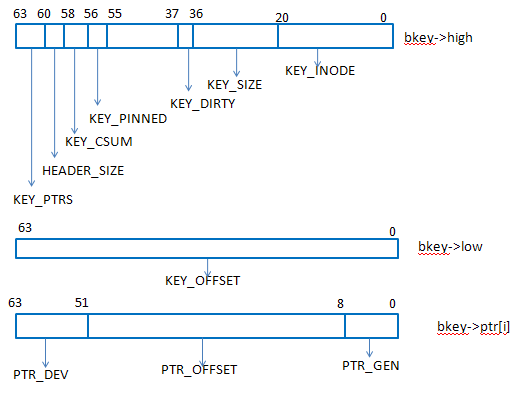

# data struct

##  bucket

```c
		struct bucket {
		       atomic_t  pin;
			   uint16_t  prio; /*每次hit都会增加，然后所有的bucket的优先级编号都会周期性地减少，不常用的会被回收，这个优先级编号主要是用来实现lru替换的*/
		       uint8_t   gen; //generation，用来invalidate bucket用的。
		       uint8_t  last_gc; /* Most out of date gen in the btree */
		       uint16_t gc_mark; /* Bitfield used by GC. See below for field */
		};
```

​	bucket大小和ssd的擦除大小一致，一般建议128K~2M。bucket内空间是追加的，只记录当前分配到哪个偏移了，下次分配
​	从当前记录位置往后分配。优先考虑io连线性，即使io来自不同生产者；其次考虑相关性，同一进程的数据尽量缓存到相同的bucket。

##   bkey

​	  bkey记录缓存设备和后端设备对应关系

```c
 struct bkey {	  
		__u64    high;

	    __u64    low;

	    __u64    ptr[];

};
```


其中：

- KEY_INODE:表示一个后端设备的id编号（后端设备在cache set中一般以bdev0，bdev1这种方式出现）
- KEY_SIZE：表示该bkey所对应缓存数据的大小
- KEY_DIRTY：表示该块缓存数据是否是脏数据
- KEY_PTRS：表示cache设备的个数（多个ptr是用来支持多个cache设备的，多个cache设备只对脏数据和元数据做镜像）
- KEY_OFFSET：bkey所缓存的hdd上的那段数据区域的结束地址
- PTR_DEV：cache设备
- PTR_OFFSET：在缓存设备中缓存的数据的起始地址
- PTR_GEN：对应cache的bucket的迭代数（版本）

## bset

一个bset是一个bkey的数组，在内存中的bset是一段连续的内存，并且以bkey排序的（bkey之间进行比较的时候是先比较KEY_INODE，如果KEY_INODE相同，再比较KEY_OFFSET）。
bset在磁盘上（缓存设备）有很多，但是内存中一个btree node只有4个bset。